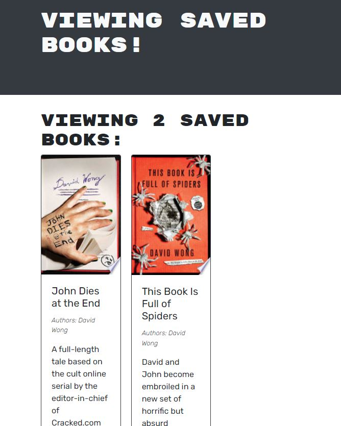

# Book Search Engine

  ## Badges
  \
  

  

  

  

  

  
  
  ## Description
 A project to refactor an existing REST API into a GraphQL API using Apollo
 Deployed on Heroku [here](https://mosnes-book-search.herokuapp.com)

  
  ## Table of Contents

  - [Usage](#usage)
  - [Contributing](#contributing)
  - [Testing](#testing)
  - [Questions](#questions)
  - [License](#license)
  
  ## Usage
   - Visit the [deployed app](https://mosnes-book-search.herokuapp.com)
   - Click Sign Up to create a user account
   - Use the search bar to search for books
   - Use the 'save this book' button to save a book to your collection
   - Use the 'see your books' link at the top of the page to see your collection
   - Use the 'delete this book' button to remove a book from your collection
  
  ---
  
  ## Contributing
  
  Feel free to fork and edit this repo for your own experimentation. However, I will not be actively maintaining this app or merging pull requests.
  
  ## Testing
  
  No testing is needed at this time.

  
  ## Questions
  
  If you have any questions regarding this project, please reach out to me here:

  - GitHub: [MosNes](https://github.com/MosNes)
  - Email: 7hekarl@gmail.com

  ## License

    This project is not covered under any license.
